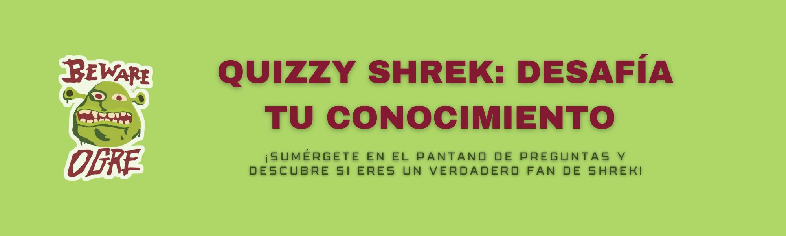

# Shrek-Quizzy

Shrek-Quizzy es un divertido juego de preguntas basado en la película animada Shrek. Pon a prueba tus conocimientos sobre la película y demuestra cuánto sabes.

## Características

- Interfaz atractiva y amigable.
- Preguntas variadas sobre la película Shrek.
- Puedes ingresar tu nombre para personalizar la experiencia.
- Diseño responsivo para dispositivos móviles y de escritorio.

## Uso

1. Clona este repositorio: `git clone https://github.com/tuusuario/shrek-quizzy.git`
2. Abre el archivo `index.html` en tu navegador web.

## Tecnologías Utilizadas

- HTML5
- CSS3
- JavaScript

## Colaboración

Si deseas contribuir a este proyecto, sigue estos pasos:

1. Realiza un fork del repositorio.
2. Crea una nueva rama: `git checkout -b feature/nueva-funcionalidad`
3. Haz tus cambios y realiza commit: `git commit -m 'Agrega una nueva funcionalidad'`
4. Realiza un push a la rama: `git push origin feature/nueva-funcionalidad`
5. Crea un pull request en GitHub.

## Créditos

- Desarrollado por: Fabiola Flores

